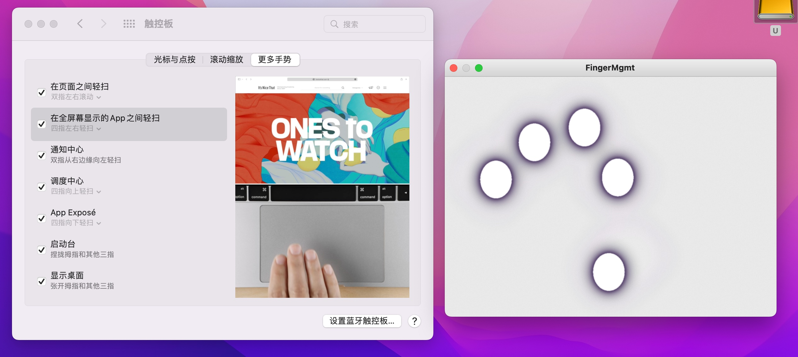
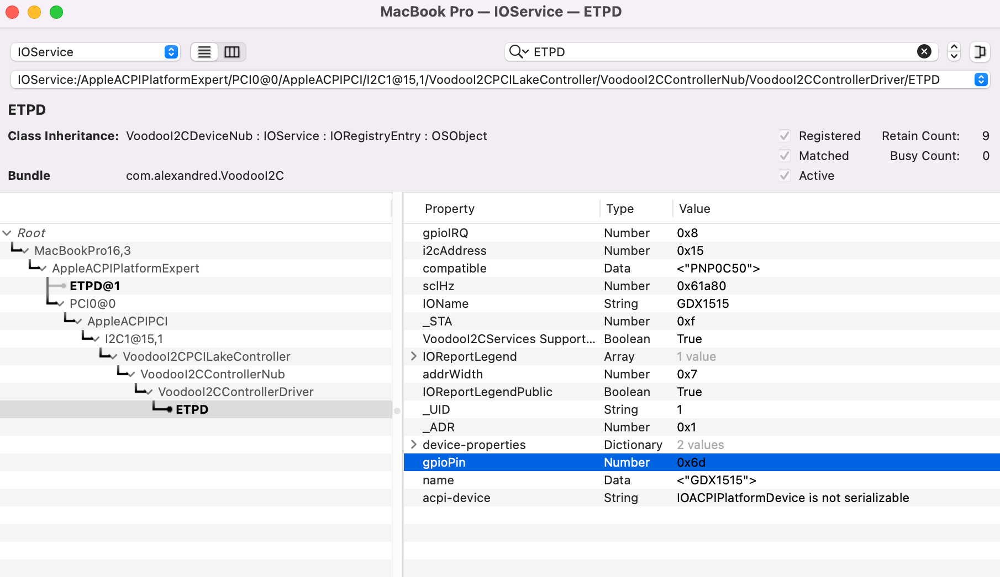

# ASUS-ZenBook13-UX334FLC-U3600FL 

## 配置概览 

| Component | Brank                                                        |
| --------- | ------------------------------------------------------------ |
| CPU       | intel Core i7-10510U                                         |
| GPU       | Intel UHD Graphics 630 \+ NVIDIA  GeForce MX250              |
| SSD       | ~~镁光 Micron 2200 系列~~ 自带的 1TB SSD 黑苹果误解，与 IONVMeFamily 不兼容 需要自己换 SSD |
| Display   | 友达 AUO5C2D 1920x1080 + ScreenXpert 2160x1080               |
| SMBIOS    | MacBookPro16,3                                               |
| WiFi      | Intel  AX201                                                 |

## 驱动细节

### 触控板

完美支持多指手势

 

而且工作在 GPIO 中断下：

 

其他部分就没有什么好说的了，都不是很棘手。

## Tips

- 这套 EFI 是赶进度赶出来的，并不是最完美的，可能出现开机提示您的电脑遇到一些问题之类的提示框
- 这套 EFI 最核心的就是触控板的 Kexts，其中 VoodooI2CHID.kext 是国光我魔改编译后的，用于解决双屏笔记本触控板触控问题
- 实际上之前还有一个 ZenBook14 也是双屏，优化还不错的，详细可见：https://github.com/sqlsec/ASUS-ZenBook14-UX434FLC
- 直接使用上面的 ZenBook14 EFI 也没问题，记得替换 ACPI 里面 DSDT 文化就行了（用于触控板工作在 GPIO 中断模式）
- DSDT-Zenbook13.aml 这个文件比较大，因为这就我提取拍错后的 DSDT 文件，触控板中断代码直接在 DSDT 里面改的，你们也可以拆分单独写个 SSDT 也可以

